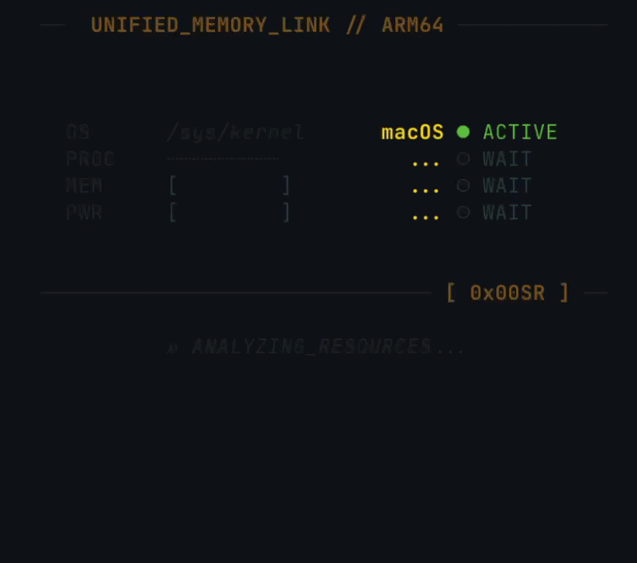

<h1> Hi, Im Sebastian █</h1>

> I am a **Computer Science student**. I always enjoy learning new things and giving my best to every project.

   

### Interests 🎯

Computer Architecture, Full Stack Development, Infrastructure, Systems Optimization, and Artificial Intelligence.

### Tech Stack 💻

<!-- Lenguajes -->
    

<!-- Frameworks / Backend -->
      

<!-- DB & Infra -->
      

 
